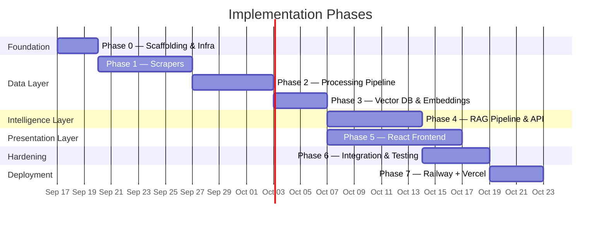
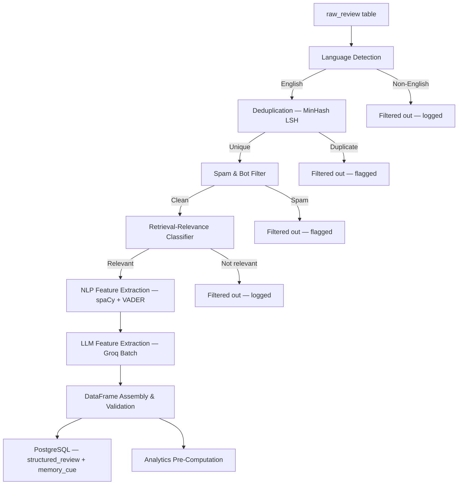
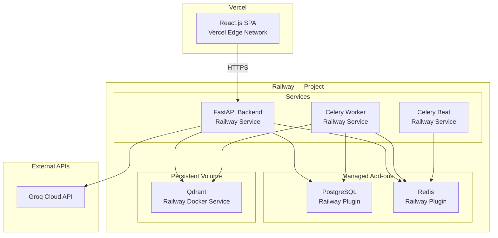
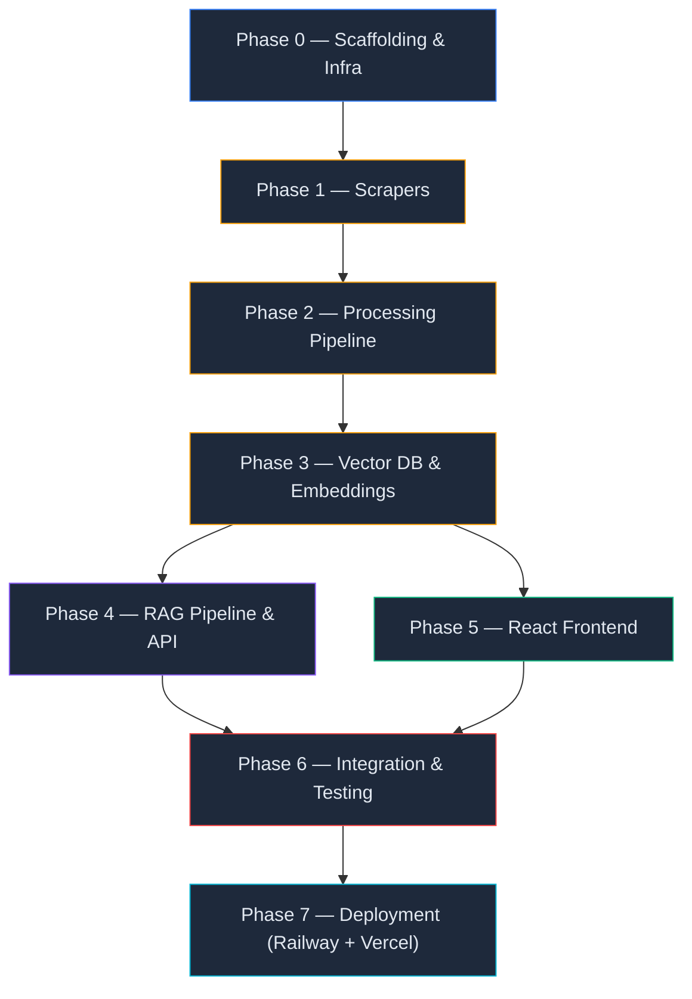

# Implementation Plan: Google Photos AI Discovery Engine

> **Source Documents:**
> [problem Statement.md](file:///Users/raunaqkaicker/Documents/Google%20photos%20AI%20discovery%20engine/docs/problem%20Statement.md) •
> [Architecture.md](file:///Users/raunaqkaicker/Documents/Google%20photos%20AI%20discovery%20engine/docs/Architecture.md)

---

## Table of Contents

1. [Implementation Overview](#1-implementation-overview)
2. [Phase 0 — Project Scaffolding & Infrastructure](#2-phase-0--project-scaffolding--infrastructure)
3. [Phase 1 — Data Acquisition Layer (Scrapers)](#3-phase-1--data-acquisition-layer-scrapers)
4. [Phase 2 — Data Processing & Structuring Pipeline](#4-phase-2--data-processing--structuring-pipeline)
5. [Phase 3 — Vector Database & Embedding Pipeline](#5-phase-3--vector-database--embedding-pipeline)
6. [Phase 4 — Groq RAG Pipeline & API](#6-phase-4--groq-rag-pipeline--api)
7. [Phase 5 — React.js Frontend](#7-phase-5--reactjs-frontend)
8. [Phase 6 — Integration, Testing & Hardening](#8-phase-6--integration-testing--hardening)
9. [Phase 7 — Deployment (Railway + Vercel)](#9-phase-7--deployment-railway--vercel)
10. [Dependency Graph](#10-dependency-graph)
11. [Risk Register](#11-risk-register)
12. [Definition of Done](#12-definition-of-done)

---

## 1. Implementation Overview

### Strategy

The build follows a **data-first, inside-out** strategy: we start at the data layer and work outward toward the user-facing frontend. Each phase produces a runnable, testable artifact before the next phase begins. This ensures the hardest constraint — **live data only, no mocks** — is satisfied from day one.

### Phase Summary



> **Note:** Phase 5 (Frontend) begins in parallel with Phase 4 (RAG) since both depend on Phase 3 completion. The API contract defined in Architecture.md allows both teams to work against the same interface concurrently.

### Technology Stack (Quick Reference)

| Layer | Technology |
| --- | --- |
| Backend | Python 3.11+, FastAPI, Celery, Redis |
| Data Processing | Pandas, spaCy, Hugging Face Transformers |
| Database | PostgreSQL 16 |
| Vector DB | ChromaDB (dev) → Qdrant (prod) |
| Embeddings | `sentence-transformers/all-MiniLM-L6-v2` |
| LLM | Groq Cloud API (`llama-3.1-70b-versatile`) |
| Frontend | React.js 18, Vite, Recharts |
| Infrastructure | Docker Compose, GitHub Actions |
| Deployment | Railway (backend), Vercel (frontend) |

---

## 2. Phase 0 — Project Scaffolding & Infrastructure

**Goal:** Establish the monorepo structure, local development environment, and all infrastructure dependencies so that every subsequent phase can immediately begin writing application code.

### 2.1 Tasks

| # | Task | Details |
| --- | --- | --- |
| 0.1 | **Initialize monorepo** | Create top-level project structure with `backend/`, `frontend/`, `docs/`, `scripts/`, `docker/` directories |
| 0.2 | **Python backend scaffold** | Initialize `backend/` with `pyproject.toml` (or `requirements.txt`), FastAPI entrypoint, Pydantic settings, and directory structure per Architecture §4.5 |
| 0.3 | **React frontend scaffold** | `npx -y create-vite@latest frontend -- --template react` inside the monorepo |
| 0.4 | **Docker Compose** | Define `docker-compose.yml` with services: `postgres`, `redis`, `chromadb`, `backend`, `celery-worker`, `frontend` |
| 0.5 | **PostgreSQL schema migration** | Set up Alembic for migrations; create initial migration with tables from Architecture §8.1: `scrape_job`, `raw_review`, `structured_review`, `memory_cue`, `failure_mode`, `retrieval_archetype` |
| 0.6 | **Environment configuration** | Create `.env.example` with all required keys (Groq, Reddit, YouTube, Postgres, Redis, Qdrant, model names) per Architecture §11.3 |
| 0.7 | **CI/CD pipeline** | GitHub Actions workflow: lint (`ruff`, `eslint`), type check (`mypy`), test (`pytest`, `vitest`), build |
| 0.8 | **Gitignore & secrets** | `.gitignore` for Python, Node, `.env`, IDE files; pre-commit hook to block secrets |

### 2.2 Directory Structure (Post Phase 0)

```
Google photos AI discovery engine/
├── backend/
│   ├── api/
│   │   ├── main.py
│   │   ├── config.py
│   │   ├── routers/
│   │   ├── models/
│   │   └── services/
│   ├── scrapers/
│   ├── pipeline/
│   ├── tests/
│   ├── alembic/
│   ├── pyproject.toml
│   └── Dockerfile
├── frontend/
│   ├── src/
│   │   ├── components/
│   │   ├── hooks/
│   │   ├── services/
│   │   ├── App.jsx
│   │   └── index.jsx
│   ├── package.json
│   └── Dockerfile
├── docker/
│   └── docker-compose.yml
├── docs/
│   ├── problem Statement.md
│   ├── Architecture.md
│   └── implementationPlan.md
├── scripts/
│   └── seed_db.py
├── .env.example
├── .github/
│   └── workflows/
│       └── ci.yml
└── README.md
```

### 2.3 Acceptance Criteria

- [ ] `docker compose up` starts all services without errors
- [ ] FastAPI returns `200 OK` on `GET /api/v1/health`
- [ ] PostgreSQL migrations run cleanly; all 6 tables exist
- [ ] React dev server loads at `localhost:5173`
- [ ] CI pipeline passes on a clean push

---

## 3. Phase 1 — Data Acquisition Layer (Scrapers)

**Goal:** Build production-grade scrapers for all 5 target sources that collect real user feedback and persist raw data to PostgreSQL.

### 3.1 Tasks

| # | Task | Details |
| --- | --- | --- |
| 1.1 | **Abstract base scraper** | Create `base_scraper.py` with interface: `scrape()`, `validate()`, `save()`. Includes retry logic, rate limiting, logging, and error handling |
| 1.2 | **Google Play Store scraper** | Use `google-play-scraper` package. Target: Google Photos app reviews. Filter by relevance keywords. Extract: text, rating, date, thumbs_up count, review_id |
| 1.3 | **Apple App Store scraper** | Use `app-store-scraper` package. Same extraction schema as Play Store |
| 1.4 | **Reddit scraper** | Use `asyncpraw` (Async PRAW). Target subreddits: `r/googlephotos`, `r/google`, `r/Android`, `r/ios`. Collect posts + comments. Extract: title, body, score, permalink, created_utc |
| 1.5 | **YouTube Comments scraper** | Use YouTube Data API v3. Target: search for "Google Photos search" / "Google Photos find old photos" videos. Extract: comment text, like_count, published_at, video_id |
| 1.6 | **Google Photos Community scraper** | Use `httpx` + `BeautifulSoup` (or Playwright for JS-rendered pages). Target: Google Photos Help Community. Extract: question title, body, replies, accepted_answer, URL |
| 1.7 | **Scrape job orchestration** | Celery tasks for each scraper. Celery Beat schedule (configurable: daily/weekly). Each run creates a `scrape_job` record tracking status, counts, errors |
| 1.8 | **Raw data persistence** | All scraped content saved to `raw_review` table with full provenance (source, URL, scraped_at, original_text) |
| 1.9 | **Scrape API endpoints** | `POST /api/v1/scrape/trigger` — manually trigger a scrape job; `GET /api/v1/scrape/status` — check job progress |
| 1.10 | **Rate limiting & politeness** | Per-source rate limits, exponential backoff, `robots.txt` compliance, user-agent rotation |

### 3.2 Scraper Configuration

```python
# backend/scrapers/config.py

SCRAPER_CONFIG = {
    "playstore": {
        "app_id": "com.google.android.apps.photos",
        "lang": "en",
        "country": "us",
        "count": 5000,
        "sort": "relevance",
        "filter_keywords": ["find", "search", "old photo", "can't find", "retrieve"],
    },
    "appstore": {
        "app_name": "google-photos",
        "country": "us",
        "count": 5000,
    },
    "reddit": {
        "subreddits": ["googlephotos", "google", "Android", "ios", "photography"],
        "search_queries": [
            "find old photo", "search photos", "can't find picture",
            "photo search not working", "looking for old picture",
        ],
        "time_filter": "year",
        "limit": 1000,
    },
    "youtube": {
        "search_queries": [
            "Google Photos search tips",
            "find old photos Google Photos",
            "Google Photos search not working",
        ],
        "max_results_per_query": 50,
        "max_comments_per_video": 200,
    },
    "community": {
        "base_url": "https://support.google.com/photos/community",
        "max_pages": 100,
        "categories": ["search", "find photos", "missing photos"],
    },
}
```

### 3.3 Acceptance Criteria

- [ ] Each scraper independently collects ≥100 real reviews in a test run
- [ ] All scraped data persists to `raw_review` table with valid `source_url`
- [ ] `scrape_job` table tracks status (`pending`, `running`, `completed`, `failed`) with counts
- [ ] Rate limits are respected — no 429/ban responses during test runs
- [ ] Celery Beat schedules fire correctly in Docker environment
- [ ] `POST /api/v1/scrape/trigger` triggers a scrape and returns job ID
- [ ] Duplicate detection prevents re-inserting identical reviews across runs

---

## 4. Phase 2 — Data Processing & Structuring Pipeline

**Goal:** Transform raw scraped text into rigorously structured Pandas DataFrames with extracted features (memory cues, failure modes, retrieval archetypes) ready for embedding and analytics.

### 4.1 Tasks

| # | Task | Details |
| --- | --- | --- |
| 2.1 | **Language detection** | Use `langdetect` or `fasttext` to filter to English-language content. Log and retain non-English counts for coverage reporting |
| 2.2 | **Deduplication engine** | Implement MinHash LSH (using `datasketch` library) for near-duplicate detection across sources. Threshold: Jaccard similarity ≥ 0.85 → mark as duplicate |
| 2.3 | **Spam & bot filter** | Heuristic rules (character count < 10, emoji-only, keyword-spam) + optional zero-shot classifier for review-farm detection |
| 2.4 | **Retrieval-relevance classifier** | Zero-shot classification using Hugging Face (`facebook/bart-large-mnli` or similar). Labels: `retrieval_relevant`, `not_relevant`. Only reviews about *finding/searching existing photos under incomplete memory* pass through. Filter out: upload issues, storage complaints, general feature requests, crash reports |
| 2.5 | **Feature extraction — NLP layer** | spaCy NER for entities (locations, people, dates). Regex patterns for temporal expressions ("last year", "sometime in 2023"). Sentiment analysis via `VADER` or `TextBlob` |
| 2.6 | **Feature extraction — LLM layer** | Batch extraction using Groq API. For each relevant review, extract structured JSON: `memory_cues[]`, `forgotten_attributes[]`, `search_behavior[]`, `failure_mode`, `outcome`, `photo_category`, `retrieval_archetype`. Use few-shot prompting with validated examples |
| 2.7 | **DataFrame construction** | Assemble all extracted features into a Pandas DataFrame matching the schema from Architecture §4.4. Validate with Pandera or Great Expectations |
| 2.8 | **Persist structured data** | Write DataFrame rows to `structured_review`, `memory_cue` tables. Link to `failure_mode` and `retrieval_archetype` lookup tables |
| 2.9 | **Pipeline orchestration** | Wire cleaning → classification → extraction → persistence as a Celery pipeline. Each stage logs metrics (input count, pass-through count, processing time) |
| 2.10 | **Analytics pre-computation** | Compute aggregate statistics from structured data: failure mode distribution, memory cue frequencies, outcome breakdown by source. Store in Redis or as materialized queries for the analytics endpoints |

### 4.2 Pipeline Flow



### 4.3 LLM Extraction Prompt (Template)

```text
You are a UX research data analyst. Given the following user review about Google Photos, 
extract a structured JSON object with these fields:

- memory_cues: list of things the user remembers about the photo (e.g., "trip to Goa", "red dress", "restaurant")
- forgotten_attributes: list of things the user has forgotten (e.g., "exact date", "location name", "album")
- search_behavior: list of actions the user took to find the photo (e.g., "searched by keyword", "scrolled manually", "asked friend")
- failure_mode: the primary reason retrieval failed (one of: memory_failure, query_translation_failure, vocabulary_mismatch, metadata_dependency, context_loss, temporal_uncertainty, location_uncertainty, person_ambiguity, search_strategy_failure, result_ranking_failure, retrieval_confidence_failure, other)
- outcome: one of: retrieved, partial, abandoned, unknown
- photo_category: type of photo (e.g., travel, medical, receipt, screenshot, food, event, document, personal_memory, other)
- retrieval_archetype: one of: event_based_memory, story_based_memory, visual_memory_retrieval, approximate_time_retrieval, relationship_based_retrieval, object_based_retrieval, text_memory_retrieval, other
- user_effort_signal: brief description of frustration or effort indicators

If a field cannot be determined from the review, set it to null.

Review: "{review_text}"

Respond with valid JSON only.
```

### 4.4 Acceptance Criteria

- [ ] Pipeline processes the full `raw_review` table end-to-end without manual intervention
- [ ] Retrieval-relevance classifier achieves ≥80% precision on a manually labeled sample of 100 reviews
- [ ] Deduplication correctly identifies cross-source duplicates (manual spot-check of 20 pairs)
- [ ] Structured DataFrame has zero null values in required fields (`source`, `source_url`, `cleaned_text`)
- [ ] LLM extraction produces valid JSON for ≥95% of inputs (malformed responses are retried or flagged)
- [ ] `structured_review` and `memory_cue` tables populated with all extracted records
- [ ] Analytics pre-computation completes and returns valid aggregates via `GET /api/v1/analytics/*`
- [ ] Full pipeline processing rate: ≥50 reviews/minute (including Groq API calls)

---

## 5. Phase 3 — Vector Database & Embedding Pipeline

**Goal:** Generate embeddings for all structured reviews, load them into ChromaDB (dev) / Qdrant (prod), and provide a working semantic search interface.

### 5.1 Tasks

| # | Task | Details |
| --- | --- | --- |
| 3.1 | **Embedding service** | Create `embedder.py` using `sentence-transformers/all-MiniLM-L6-v2`. Batch embedding generation for all structured reviews. Handle GPU acceleration if available, CPU fallback |
| 3.2 | **Text chunking** | Reviews > 512 tokens split with 50-token overlap using `langchain.text_splitter.RecursiveCharacterTextSplitter` (sentence-aware). Each chunk retains parent review metadata |
| 3.3 | **ChromaDB collection setup** | Create `discovery_reviews` collection with schema per Architecture §9.1. Configure HNSW index with cosine similarity |
| 3.4 | **Bulk ingestion** | Batch-insert all embeddings + metadata into ChromaDB. Track ingestion progress and error counts |
| 3.5 | **Semantic search service** | Create `retriever.py` with `search(query: str, top_k: int, filters: dict)` method. Supports metadata filtering by source, photo_category, failure_mode, outcome |
| 3.6 | **Cross-encoder reranker** | Implement `reranker.py` using `cross-encoder/ms-marco-MiniLM-L-6-v2`. Takes top-50 from vector search, re-ranks to top-15 |
| 3.7 | **Incremental sync** | After new scrape runs, only embed and insert new/updated reviews (delta sync based on `structured_review.id` not already in vector DB) |
| 3.8 | **Search quality validation** | Build a small test suite of 20 known queries with expected relevant reviews. Measure Recall@15 and MRR |

### 5.2 Acceptance Criteria

- [ ] All structured reviews are embedded and stored in ChromaDB
- [ ] `search("travel photos from last year")` returns semantically relevant reviews in top-10 results
- [ ] Metadata filtering works correctly (`source=reddit` returns only Reddit reviews)
- [ ] Reranker measurably improves relevance (MRR improvement ≥ 10% over base vector search on test queries)
- [ ] Incremental sync correctly adds new reviews without duplicating existing ones
- [ ] End-to-end search latency: < 500ms for query → reranked top-15 (excluding LLM)

---

## 6. Phase 4 — Groq RAG Pipeline & API

**Goal:** Wire the retrieval + reranking pipeline to Groq's LLM with the UX Researcher persona, expose the chat endpoint via FastAPI with SSE streaming, and deliver fully cited answers.

### 6.1 Tasks

| # | Task | Details |
| --- | --- | --- |
| 4.1 | **Groq client setup** | Initialize Groq Python SDK. Configure model (`llama-3.1-70b-versatile`), temperature (0.2), max_tokens (4096), streaming (enabled) |
| 4.2 | **System prompt — UX Researcher persona** | Craft the system prompt per Architecture §5.4. The LLM must: ground all answers in retrieved evidence, include inline `[1]`, `[2]` citations, distinguish direct evidence vs. inference vs. hypothesis, quantify with caveats, structure responses as Problem → Evidence → Frequency → Failure Mode → Opportunity |
| 4.3 | **Prompt assembly engine** | `prompt_engine.py` — assembles the full prompt: system instruction + retrieved context chunks (with numbered source references) + user query. Manages token budget: system (500) + context (2500) + query (100) + response (4096) |
| 4.4 | **RAG orchestration service** | `rag_service.py` — full pipeline: embed query → vector search (top-50) → rerank (top-15) → prompt assembly → Groq call → parse response + extract citation references → return structured `ChatResponse` |
| 4.5 | **SSE streaming endpoint** | `POST /api/v1/chat` — accepts `ChatRequest`, returns `text/event-stream`. Streams tokens as they arrive from Groq. Appends structured `citations` JSON event at end of stream |
| 4.6 | **Citation extraction** | Parse the LLM response for `[n]` references. Map each reference back to the source chunk's metadata (source_url, original_text, source, published_at). Return as structured citation objects |
| 4.7 | **Citation detail endpoint** | `GET /api/v1/citations/{id}` — returns full review text, all extracted metadata, and original source URL for a specific cited review |
| 4.8 | **Session management** | Track conversation sessions (`session_id`) in Redis. Support multi-turn context by appending prior Q&A pairs to the prompt (within token budget) |
| 4.9 | **Analytics endpoints** | Wire the pre-computed analytics from Phase 2 to API endpoints: `GET /api/v1/analytics/opportunities`, `memory-cues`, `failure-modes`, `archetypes` |
| 4.10 | **Response caching** | Cache frequent/identical queries in Redis (TTL: 1 hour). Cache key: hash of (query + filters). Bypass cache for queries with `session_id` (conversational context) |
| 4.11 | **Error handling & fallbacks** | Handle Groq rate limits (429), timeouts, malformed responses. Return graceful error messages to frontend. Implement circuit breaker pattern |

### 6.2 Prompt Structure

```
┌─────────────────────────────────────────────────────────┐
│ SYSTEM PROMPT (~500 tokens)                              │
│ "You are a senior UX researcher analyzing Google Photos  │
│  user feedback. Ground all answers in the evidence       │
│  provided. Cite sources using [n] notation..."           │
├─────────────────────────────────────────────────────────┤
│ CONTEXT (~2500 tokens)                                   │
│ [1] Source: Reddit | URL: ... | Category: travel         │
│ "I can never find my vacation photos from Goa..."        │
│                                                          │
│ [2] Source: Play Store | URL: ... | Category: medical    │
│ "Tried searching for that medicine photo but..."         │
│                                                          │
│ ... (up to 15 reranked chunks)                           │
├─────────────────────────────────────────────────────────┤
│ CONVERSATION HISTORY (if multi-turn)                     │
│ PM: "What types of photos are hardest to find?"          │
│ AI: "Based on 847 reviews, travel photos..."             │
├─────────────────────────────────────────────────────────┤
│ CURRENT QUERY                                            │
│ PM: "Drill deeper into the travel photo problem"         │
└─────────────────────────────────────────────────────────┘
```

### 6.3 Acceptance Criteria

- [ ] `POST /api/v1/chat` returns streaming SSE response within 2s of first token
- [ ] Every response contains at least 1 inline citation `[n]` that maps to a real review
- [ ] `GET /api/v1/citations/{id}` returns valid review metadata with working `source_url`
- [ ] Multi-turn conversations maintain context (follow-up questions reference prior answers)
- [ ] Analytics endpoints return correctly aggregated data matching PostgreSQL records
- [ ] Groq rate-limit errors are handled gracefully with user-facing retry messaging
- [ ] Response cache reduces latency for repeated queries to < 100ms

---

## 7. Phase 5 — React.js Frontend

**Goal:** Build the PM-facing conversational UI with streaming chat, inline citations, citation explorer, and analytics dashboards.

> **Parallel with Phase 4:** Frontend development begins after Phase 3 (vector DB) is complete. The team uses the API contract from Architecture §10 to build against mock/stub endpoints initially, then integrates with the live API once Phase 4 is ready.

### 7.1 Tasks

| # | Task | Details |
| --- | --- | --- |
| 5.1 | **Design system & global styles** | Define color palette (dark mode primary), typography (Inter/Outfit from Google Fonts), spacing scale, component tokens in `index.css` |
| 5.2 | **Layout shell** | `MainLayout.jsx`, `Sidebar.jsx`, `Header.jsx`. Responsive layout: sidebar (navigation) + main content (chat or dashboard). Sidebar toggles between Chat and Dashboard views |
| 5.3 | **Chat — ChatWindow.jsx** | Main chat container. Renders message history. Input bar with send button at bottom. Auto-scroll to latest message. Loading state with typing indicator |
| 5.4 | **Chat — MessageBubble.jsx** | Renders individual messages (user + AI). AI messages support markdown rendering (`react-markdown`). Inline citation chips `[1]` rendered as clickable tags |
| 5.5 | **Chat — CitationTag.jsx** | Clickable inline chip. On click: opens CitationPanel with full review details. Visual: pill shape with source icon (Reddit, Play Store, etc.) |
| 5.6 | **Chat — SuggestedQuestions.jsx** | Pre-seeded cards displayed before first message. Contains the 4 key investigative questions from the problem statement. Clicking a card sends it as a query |
| 5.7 | **Chat — SSE streaming integration** | `useChat.js` hook. Connects to `POST /api/v1/chat` SSE stream. Appends tokens to current message in real-time. Parses final `citations` event and attaches to message |
| 5.8 | **Citation Explorer — CitationPanel.jsx** | Slide-out side panel. Shows full review text, source platform badge, date, source URL (clickable), extracted metadata (memory cues, failure mode, photo category) |
| 5.9 | **Citation Explorer — ReviewCard.jsx** | Individual review card within the citation panel. Highlights the quoted excerpt. Links to original source |
| 5.10 | **Citation Explorer — SourceBadge.jsx** | Platform-specific icon + color badge (Reddit orange, Play Store green, App Store blue, YouTube red, Community teal) |
| 5.11 | **Dashboard — OpportunityMatrix.jsx** | Interactive comparison table (per problem statement Output 7). Columns: Opportunity, Frequency, Severity, Retrieval failure signal, Cross-source evidence, User effort, Memory-system mismatch, Evidence strength. Sortable columns. Fetches from `GET /api/v1/analytics/opportunities` |
| 5.12 | **Dashboard — MemoryCueMap.jsx** | Horizontal diverging bar chart: left = "Remembered" cues, right = "Forgotten" attributes. Grouped by photo category. Uses Recharts. Fetches from `GET /api/v1/analytics/memory-cues` |
| 5.13 | **Dashboard — FailureModeChart.jsx** | Treemap or horizontal bar chart of failure mode distribution. Clickable: clicking a failure mode filters to related reviews. Fetches from `GET /api/v1/analytics/failure-modes` |
| 5.14 | **Dashboard — ArchetypeCards.jsx** | Card grid displaying each retrieval archetype (event-based, story-based, visual-memory, etc.). Each card shows: name, description, example quote, frequency badge. Fetches from `GET /api/v1/analytics/archetypes` |
| 5.15 | **API service layer** | `api.js` — Axios wrapper with base URL config, auth headers, error interceptors. Functions: `sendChatMessage()`, `getCitation()`, `getOpportunities()`, `getMemoryCues()`, `getFailureModes()`, `getArchetypes()` |
| 5.16 | **Responsive design** | Mobile-friendly layout (stacked on small screens). Citation panel as modal on mobile instead of side panel |
| 5.17 | **Micro-animations & polish** | Smooth message entry animations, citation tag hover effects, sidebar transitions, loading skeleton screens, glassmorphism card effects |

### 7.2 UI Wireframe (Conceptual)

```
┌──────────────────────────────────────────────────────────────────┐
│  🔍 Discovery Engine                          [Chat] [Dashboard] │
├────────┬─────────────────────────────────────────┬───────────────┤
│        │                                         │               │
│  Nav   │   💬 Conversational Chat                │  Citation     │
│        │                                         │  Explorer     │
│  Chat  │   ┌─────────────────────────────────┐   │               │
│        │   │ What types of old photos are     │   │  📄 Review    │
│  Dash  │   │ most difficult to retrieve?      │   │  Source: Reddit│
│  board │   └─────────────────────────────────┘   │  Date: Mar 14 │
│        │                                         │  Category:    │
│        │   ┌─────────────────────────────────┐   │   Travel      │
│        │   │ Based on analysis of 1,247       │   │  Failure:     │
│        │   │ reviews, travel photos are the   │   │   Temporal    │
│        │   │ most cited category [1][2]...     │   │   uncertainty │
│        │   └─────────────────────────────────┘   │               │
│        │                                         │  "I can never │
│        │   ┌─────────────────────────────────┐   │   find my     │
│        │   │ 💬 Ask a follow-up question...   │   │   vacation    │
│        │   └─────────────────────────────────┘   │   photos..."  │
│        │                                         │               │
└────────┴─────────────────────────────────────────┴───────────────┘
```

### 7.3 Acceptance Criteria

- [ ] Chat UI sends queries and displays streaming responses in real-time
- [ ] Inline citation tags `[1]`, `[2]` are clickable and open the citation panel
- [ ] Citation panel shows full review text, source URL (clickable), platform badge, and extracted metadata
- [ ] Suggested questions are displayed on first load and fire correctly
- [ ] Dashboard views render with live data from analytics endpoints
- [ ] Opportunity matrix is sortable by any column
- [ ] UI is responsive and functional on mobile viewports
- [ ] All interactions have smooth animations (no jarring transitions)
- [ ] Lighthouse Performance score ≥ 80

---

## 8. Phase 6 — Integration, Testing & Hardening

**Goal:** End-to-end integration testing, performance optimization, error handling hardening, and documentation.

### 8.1 Tasks

| # | Task | Details |
| --- | --- | --- |
| 6.1 | **End-to-end integration test** | Full flow: trigger scrape → pipeline processes → embeddings generated → chat query → response with valid citations → citation drill-down to original source. Automated test script |
| 6.2 | **Load testing** | Use `locust` to simulate 10 concurrent PM sessions. Target: < 3s time-to-first-token for chat, < 500ms for analytics endpoints |
| 6.3 | **Search quality evaluation** | Curate 30 test queries covering all 4 investigative questions. Manually evaluate: relevance of top-5 citations, factual accuracy of answers, citation correctness. Target: ≥ 85% citation accuracy |
| 6.4 | **Error recovery testing** | Simulate: Groq API down, PostgreSQL connection drop, ChromaDB unavailable, scraper 429 errors. Verify graceful degradation and user-facing error messages |
| 6.5 | **Data integrity audit** | Verify every `source_url` in citations is a valid, accessible URL. Spot-check 50 structured reviews against original raw text for extraction accuracy |
| 6.6 | **Security hardening** | CORS configuration (allowlist frontend origin only). API key rotation procedure documented. Input sanitization audit. Rate limiting on public endpoints |
| 6.7 | **Monitoring & logging** | Structured logging (JSON) across all services. Key metrics: scrape success rate, pipeline throughput, search latency, Groq token usage, error rates. Dashboard in logs (ELK/Grafana optional) |
| 6.8 | **Documentation** | Update `README.md` with setup instructions, environment variables, architecture overview. API documentation auto-generated via FastAPI `/docs`. User guide for PM-facing features |
| 6.9 | **Production Docker config** | Optimize Dockerfiles (multi-stage builds). Production `docker-compose.prod.yml` with resource limits, health checks, restart policies. Qdrant replaces ChromaDB |
| 6.10 | **Demo preparation** | Seed the system with a full scrape run. Prepare a walkthrough script demonstrating all 4 investigative questions with live data |

### 8.2 Acceptance Criteria

- [ ] End-to-end flow completes without manual intervention
- [ ] 10 concurrent sessions maintain < 3s time-to-first-token
- [ ] ≥ 85% of citations in test queries are factually accurate and point to valid sources
- [ ] System recovers gracefully from all simulated failure scenarios
- [ ] No secrets are exposed in logs, API responses, or version control
- [ ] `README.md` is sufficient for a new developer to set up and run the project
- [ ] Production Docker Compose starts all services with health checks passing

---

## 9. Phase 7 — Deployment (Railway + Vercel)

**Goal:** Deploy the full production system with the FastAPI backend, Celery workers, and all data services on **Railway**, and the React.js frontend on **Vercel**. Establish CI/CD pipelines for automated deployments from `main`.

### 9.1 Deployment Topology



### 9.2 Tasks

| # | Task | Details |
| --- | --- | --- |
| 7.1 | **Railway project setup** | Create a new Railway project. Link to the GitHub repository. Configure auto-deploy from `main` branch |
| 7.2 | **Railway — FastAPI service** | Deploy `backend/` as a Railway service. Start command: `uvicorn api.main:app --host 0.0.0.0 --port $PORT`. Set Railway to detect the `Dockerfile` in `backend/` |
| 7.3 | **Railway — PostgreSQL** | Provision Railway's managed PostgreSQL plugin. Copy the `DATABASE_URL` connection string to service environment variables. Run Alembic migrations via a one-off Railway command: `railway run alembic upgrade head` |
| 7.4 | **Railway — Redis** | Provision Railway's managed Redis plugin. Copy the `REDIS_URL` to service environment variables. Used by Celery (broker + result backend) and response caching |
| 7.5 | **Railway — Qdrant** | Deploy Qdrant as a Docker service on Railway using the official `qdrant/qdrant` image. Attach a persistent volume mounted at `/qdrant/storage`. Expose internal networking to the FastAPI service |
| 7.6 | **Railway — Celery worker** | Deploy as a separate Railway service sharing the same Docker image as the backend. Start command: `celery -A api.celery_app worker --loglevel=info --concurrency=2`. Shares all environment variables with FastAPI service |
| 7.7 | **Railway — Celery Beat** | Deploy as a separate Railway service. Start command: `celery -A api.celery_app beat --loglevel=info`. Triggers scheduled scrape jobs |
| 7.8 | **Railway — Environment variables** | Configure all secrets via Railway's variable management (not committed to repo): `GROQ_API_KEY`, `REDDIT_CLIENT_ID`, `REDDIT_CLIENT_SECRET`, `YOUTUBE_API_KEY`, `DATABASE_URL`, `REDIS_URL`, `QDRANT_URL`, `EMBEDDING_MODEL`, `RERANKER_MODEL`, `CORS_ORIGINS` |
| 7.9 | **Railway — Health checks** | Configure Railway health checks on the FastAPI service: endpoint `GET /api/v1/health`, interval 30s, timeout 10s. Set restart policy on failure |
| 7.10 | **Railway — Networking** | Generate a public domain for the FastAPI service (e.g., `api-discovery.up.railway.app`). Configure internal networking between FastAPI ↔ PostgreSQL ↔ Redis ↔ Qdrant. All inter-service traffic stays private |
| 7.11 | **Vercel — Frontend deployment** | Import the `frontend/` directory into Vercel. Framework preset: Vite. Build command: `npm run build`. Output directory: `dist`. Auto-deploy from `main` branch |
| 7.12 | **Vercel — Environment variables** | Set `VITE_API_BASE_URL` to the Railway FastAPI public URL (e.g., `https://api-discovery.up.railway.app`). Set any other frontend-specific config |
| 7.13 | **Vercel — Build settings** | Root directory: `frontend/`. Node.js version: 18.x. Install command: `npm install`. Build command: `npm run build` |
| 7.14 | **CORS configuration** | Update FastAPI CORS middleware to allowlist the Vercel frontend domain (e.g., `https://discovery-engine.vercel.app`). Remove `localhost` origins in production |
| 7.15 | **Custom domains (optional)** | Configure custom domain on Vercel (e.g., `discovery.yourteam.com`). Configure custom domain on Railway (e.g., `api.discovery.yourteam.com`). Update CORS and `VITE_API_BASE_URL` accordingly |
| 7.16 | **CI/CD pipeline** | GitHub Actions workflow: on push to `main` → run tests → if green, Railway auto-deploys backend, Vercel auto-deploys frontend. Add staging environment on Railway for `develop` branch |
| 7.17 | **Database migrations in CI** | Add a GitHub Actions step (or Railway deploy hook) that runs `alembic upgrade head` before the new backend version starts serving traffic |
| 7.18 | **Monitoring & alerts** | Configure Railway metrics dashboard: CPU, memory, request count, error rate for each service. Set up alert notifications (Slack/email) for: service crashes, high error rate (>5%), Celery task failures |
| 7.19 | **Logging** | Railway captures stdout/stderr automatically. Ensure all backend services use structured JSON logging. Verify logs are searchable in Railway's log viewer |
| 7.20 | **Rollback procedure** | Document rollback steps: Railway supports instant rollback to previous deployment. Vercel supports instant rollback via deployment history. Database rollback: `alembic downgrade -1` |

### 9.3 Railway Service Configuration

| Service | Source | Start Command | RAM | vCPUs |
| --- | --- | --- | --- | --- |
| **FastAPI** | `backend/Dockerfile` | `uvicorn api.main:app --host 0.0.0.0 --port $PORT` | 1 GB | 1 |
| **Celery Worker** | `backend/Dockerfile` | `celery -A api.celery_app worker --loglevel=info --concurrency=2` | 2 GB | 1 |
| **Celery Beat** | `backend/Dockerfile` | `celery -A api.celery_app beat --loglevel=info` | 512 MB | 0.5 |
| **Qdrant** | `qdrant/qdrant:latest` | Default entrypoint | 1 GB | 1 |
| **PostgreSQL** | Railway Plugin | Managed | — | — |
| **Redis** | Railway Plugin | Managed | — | — |

### 9.4 Vercel Configuration

```json
// frontend/vercel.json
{
  "buildCommand": "npm run build",
  "outputDirectory": "dist",
  "framework": "vite",
  "rewrites": [
    { "source": "/(.*)", "destination": "/index.html" }
  ],
  "headers": [
    {
      "source": "/(.*)",
      "headers": [
        { "key": "X-Content-Type-Options", "value": "nosniff" },
        { "key": "X-Frame-Options", "value": "DENY" },
        { "key": "Referrer-Policy", "value": "strict-origin-when-cross-origin" }
      ]
    }
  ]
}
```

### 9.5 Environment Variable Map

| Variable | Where Set | Used By |
| --- | --- | --- |
| `DATABASE_URL` | Railway (auto from PostgreSQL plugin) | FastAPI, Celery Worker |
| `REDIS_URL` | Railway (auto from Redis plugin) | FastAPI, Celery Worker, Celery Beat |
| `QDRANT_URL` | Railway (internal network URL) | FastAPI, Celery Worker |
| `GROQ_API_KEY` | Railway (manual secret) | FastAPI (RAG service) |
| `REDDIT_CLIENT_ID` | Railway (manual secret) | Celery Worker (scraper) |
| `REDDIT_CLIENT_SECRET` | Railway (manual secret) | Celery Worker (scraper) |
| `YOUTUBE_API_KEY` | Railway (manual secret) | Celery Worker (scraper) |
| `CORS_ORIGINS` | Railway (manual) | FastAPI (CORS middleware) |
| `EMBEDDING_MODEL` | Railway (manual) | FastAPI, Celery Worker |
| `RERANKER_MODEL` | Railway (manual) | FastAPI |
| `VITE_API_BASE_URL` | Vercel (environment variable) | React frontend (API calls) |

### 9.6 Acceptance Criteria

- [ ] FastAPI backend is live and reachable at Railway-generated URL; `GET /api/v1/health` returns `200 OK`
- [ ] PostgreSQL and Redis are provisioned and connected (verified via health check)
- [ ] Qdrant is running with persistent storage; vector search returns results
- [ ] Celery Worker and Beat are running; scheduled scrape jobs execute on schedule
- [ ] React frontend is live on Vercel; loads without errors; connects to Railway backend
- [ ] CORS is correctly configured — frontend can make API calls without CORS errors
- [ ] Full end-to-end flow works in production: chat query → streaming response → citation drill-down
- [ ] Push to `main` triggers automated deployment on both Railway and Vercel
- [ ] Rollback to previous deployment completes in < 2 minutes on both platforms
- [ ] All secrets are stored in platform environment variables; none are in version control
- [ ] Railway metrics dashboard shows healthy resource utilization under normal load

---

## 10. Dependency Graph



**Critical path:** P0 → P1 → P2 → P3 → P4 → P6 → P7

**Parallelizable:** P5 runs in parallel with P4 (both depend on P3)

---

## 11. Risk Register

| # | Risk | Likelihood | Impact | Mitigation |
| --- | --- | --- | --- | --- |
| R1 | **Scraper blocking / rate limiting** | High | High | Implement rotating proxies, exponential backoff, and user-agent rotation. Fallback: manual data export from platform dashboards |
| R2 | **Low volume of retrieval-relevant reviews** | Medium | High | Broaden search queries and subreddits. Lower relevance classifier threshold. Supplement with Google Photos Community (highest signal source) |
| R3 | **Groq API instability or rate limits** | Medium | Medium | Implement response caching aggressively. Circuit breaker with fallback message. Queue requests during rate-limit windows |
| R4 | **LLM extraction hallucination** | Medium | High | Use structured JSON output with validation. Reject malformed responses and retry. Sample-audit 5% of extractions manually |
| R5 | **Poor retrieval quality** | Medium | High | Invest in reranker tuning. Experiment with `BGE-large` embeddings instead of `MiniLM`. Hybrid search (keyword + semantic) if pure semantic underperforms |
| R6 | **Platform ToS changes** | Low | High | Scrape only publicly accessible content. Cache data locally after first scrape. Monitor ToS pages for changes |
| R7 | **Data staleness** | Low | Medium | Celery Beat scheduled re-scrapes. Dashboard shows "data freshness" indicator (last scrape timestamp) |
| R8 | **Scope creep** | Medium | Medium | Strictly gate features against the 4 investigative questions. Any new feature must answer: "Does this help the PM answer one of the 4 questions?" |
| R9 | **Railway cold starts** | Medium | Medium | Enable Railway's "always-on" setting for the FastAPI service to prevent cold-start latency. Celery Worker and Beat should also remain active |
| R10 | **Railway cost overrun** | Low | Medium | Monitor usage via Railway dashboard. Set resource limits per service. Start with Hobby plan; upgrade to Pro only if scrape volume demands it |
| R11 | **Vercel serverless function limits** | Low | Low | Frontend is a static SPA — no serverless functions needed. All API calls go directly to Railway backend. No Vercel function timeout concerns |

---

## 12. Definition of Done

The project is considered **complete** when all of the following are true:

### Data Layer
- [ ] ≥ 3 out of 5 scrapers are operational and have completed at least one full scrape run
- [ ] Processing pipeline has structured ≥ 500 retrieval-relevant reviews
- [ ] All structured reviews are embedded and searchable in the vector database

### Intelligence Layer
- [ ] Chat endpoint returns evidence-backed, cited answers for all 4 investigative questions
- [ ] ≥ 85% citation accuracy on a 30-query test suite
- [ ] Time-to-first-token < 3 seconds

### Presentation Layer
- [ ] Conversational chat UI with streaming responses is functional
- [ ] Inline citations are clickable and drill down to original source
- [ ] At least 2 dashboard visualizations (opportunity matrix + one chart) render with live data

### Operations
- [ ] Full system runs via `docker compose up` with no manual setup beyond `.env`
- [ ] `README.md` enables cold-start setup in < 30 minutes
- [ ] No synthetic or mock data is used anywhere in the production flow

### Deployment
- [ ] Backend is live on Railway with all 5 services healthy (FastAPI, Celery Worker, Celery Beat, PostgreSQL, Redis, Qdrant)
- [ ] Frontend is live on Vercel and connects to Railway backend without CORS errors
- [ ] CI/CD pipeline deploys both platforms automatically on push to `main`
- [ ] Rollback procedure is documented and tested on both Railway and Vercel
- [ ] All production secrets are managed via platform environment variables (zero secrets in repo)

---

## 13. Implementation Deviations (Updated during Development)

During the development process, the following functional and UI/UX changes were incorporated, deviating slightly from the original plan:
- **Backend Configuration:** Relaxed `Pydantic` schema validations (`extra: "ignore"`) in `config.py` to better support local development environments with extra environment variables.
- **Database Seeding:** Expanded `FAILURE_MODES` descriptions in `scripts/seed_db.py` to be more comprehensive (multi-sentence), and updated the seed logic to perform `UPDATE` on existing records rather than skipping them, enabling live data refreshing.
- **Backend Data Delivery:** Modified `backend/api/routers/data.py` to explicitly return individual component scores (`reach_score`, `user_pain`, `business_impact`, `evidence_strength`) to the frontend for better transparency.
- **Frontend Dashboard Enhancements:**
  - Surfaced individual LLM-assigned scores directly on the opportunity cards.
  - Added an explicit explanation of the score calculation formula (`Score (out of 100) = 35% Reach + 30% User Pain + 20% Business Impact + 15% Evidence Strength`) inside a styled info box.
  - Increased the default width of the `ChatPane` to ~45% (`leftWidth: 55`) for better initial visibility on page load.
  - Restyled card top-borders (Violet for Scraped Reviews, Pink for Classified Reviews) and unified typography for score numbers.

---

> **Next Steps:** Begin Phase 6 (Integration, Testing & Hardening) to finalize the system for production deployment. See [Architecture.md](file:///Users/raunaqkaicker/Documents/Google%20photos%20AI%20discovery%20engine/docs/Architecture.md) for the full technical specification driving each phase.
